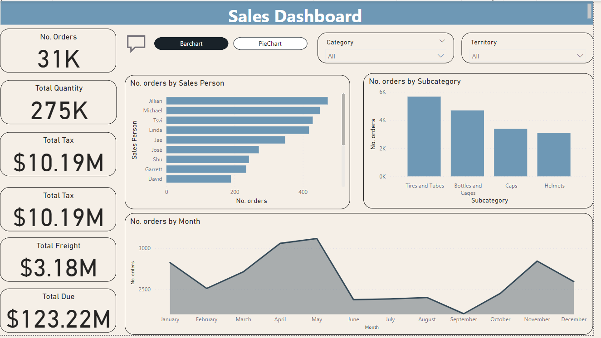
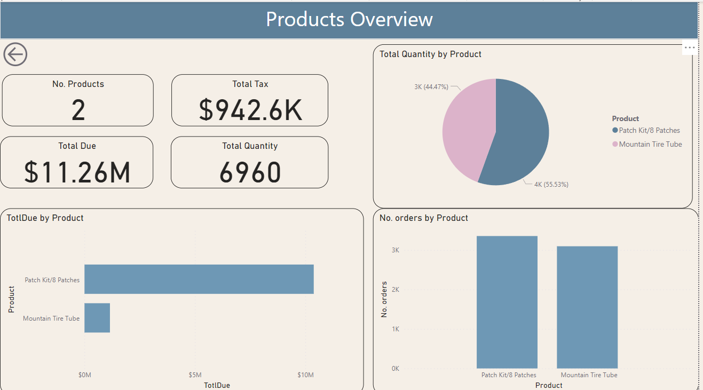
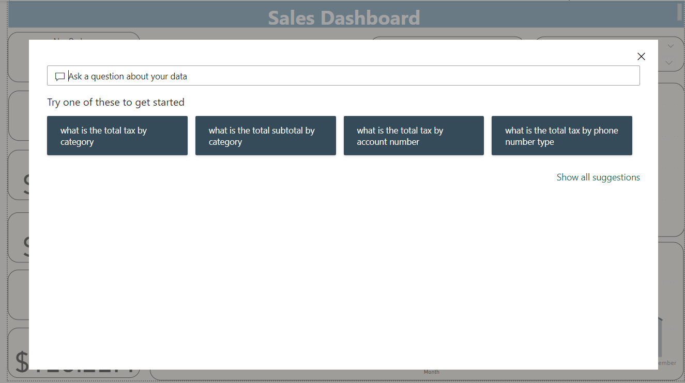

Sales Dashboard – Power BI
Overview
This project showcases an interactive sales dashboard built using Power BI with Adventure Works data. The dashboard provides key financial insights, enabling data-driven decision-making through advanced Power BI features.

Tools & Technologies
Power BI – Data visualization and reporting
DAX (Data Analysis Expressions) – Advanced calculations and custom measures
Power BI Service – Cloud-based report sharing and collaboration
Key Features
✔ Interactive Sales Dashboard – Provides insights into revenue, profit, and growth trends.
✔ DAX-based Dates Table – Enables precise time-based analysis and period comparisons.
✔ Financial Metrics – Tracks revenue, profit margins, and key performance indicators.
✔ Enhanced User Navigation – Implemented Drill Through, Bookmarks, and Q&A visuals for a dynamic experience.
✔ Cloud Publishing – Deployed to Power BI Service for seamless access and collaboration.

Getting Started
Download the .pbix file from this repository.
Open it in Power BI Desktop.
Explore the dashboard and interact with filters, visuals, and insights.
Preview

  

  

  

Deployment
The report is published on Power BI Service, allowing real-time access and collaboration.
